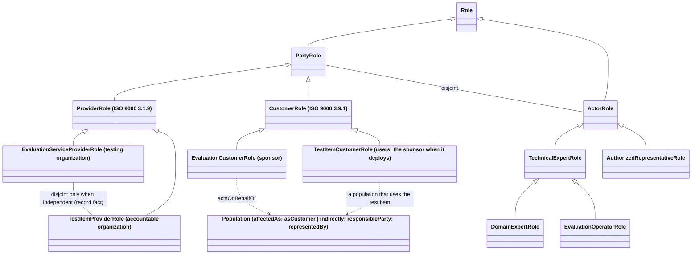

# Rulings sheet 08 (2026-09-06): the terminological box audited

Z's instruction under ruling R-48 (sheet 07, as sent): "record takes a more
abstract definition and the evaluation record is a special case. use
subclassing. look more carefully at our definitions and use subclassing more
explicitly where terms are specialization of other terms"; "the ontology
tbox needs auditing and potentially some clean up. where appropriate we can
use skos match, skos closematch, and other tools for interrelating content.
we also can use subclassing and disjointness axioms, also look for
disconnected content and make sure we're not missing relationships which
will improve navagibility". Added, on the parties: "a much clearer
distinction between the provider of the AI system under test (test item)
and the provider of the evaluation service"; the sponsor is the customer of
the evaluation service and may also be the customer of the AI system, or an
organization acting on behalf of affected stakeholders who are its customers
or are affected through other stakeholders' use. On the populations: "for
each affective population we need to know represented or interviewed, and
we need an actor (and be a person or an organization) responsible. there is
also a domain expert who signs off on the DSO which itself requires that the
stakeholder input (either represented or interviewed) has been made
available to the domain expert who signs off on the DSO". From the
block-and-wire walkthrough (sheet 09): account executive becomes authorized
representative; accountable organization becomes test item provider.

Branch `tbox-audit-2` (a stale branch named `tbox-audit`, an ancestor of
main, is checked out in another worktree and could not be reused). Nothing
here edits the rulings register; C-26 closes when Z records the ruling.

## Counts, before and after

Read from the graphs by `scratchpad/tbox/inventory.py` (rdflib over the
eight source files) at main d5ba4df and at the branch head.

| What | Before | After |
|---|---|---|
| `skos:Concept` (adopted, refined, coined) | 62 (47, 11, 4) | 66 (47, 15, 4) |
| anchor relations (specializes, corresponds, synonym) | 10, 1, 0 | 13, 2, 0 |
| canonical citations; seeAlso citations | 71; 65 | 75; 73 |
| quotes (machine, human, pending) | 85, 48, 0 | 86, 57, 0 |
| `skos:broader` (each with its `skos:narrower`) | 0 | 20 |
| `skos:related` (stated on one or both sides; read both ways) | 0 | 177 |
| SKOS mappings to the standards (exact, broad, close, related) | 0 | 62 (47, 13, 2, 0) |
| the standards' concepts (`src:` clause nodes, `ogc:SourceConcept`) | 0 | 52 |
| concepts with no SKOS relation to another concept | 62 | 0 |
| concepts referenced by no crosswalk row, essential or concern | 7 | 5 |
| EPO `owl:Class`; properties | 40; 46 | 53; 50 |
| `rdfs:subClassOf` between EPO classes | 0 | 12 |
| `owl:disjointWith` | 0 | 8 |
| `ogc:term` back-links (classes naming a term); classes with a why-not comment | 0; 0 | 41 (40 classes); 13 |
| EPO classes reached by no binding string, shape target, crosswalk row, back-link or comment | 13 | 0 |
| role individuals | 6 | 7 |
| record shapes; SPARQL constraints added | 39; 0 | 39; 3 (S0-Parties, S0-Population, S1-DsoRelease) |
| counterexamples | 10 | 11 |
| explorer nodes; links | 675; 1,278 | 758; 1,718 |
| tests | 129 | 137 (`tests/test_tbox.py`) |

`ogc doctor` prints `VERDICT: PASS`; the gate's verdict is in the final
report.

## What was added, and why

### Classes and properties in `vocabulary/epo.ttl`

| Subject | Relation | Object | Why |
|---|---|---|---|
| `ogc:term` | `a` | `owl:ObjectProperty` (domain `owl:Class`, range `skos:Concept`) | the back-link from a class to the glossary term naming it, the inverse of the `ogc:binding` string, drawable and printable; declared once |
| `epo:PartyRole`, `epo:ActorRole` | `rdfs:subClassOf` | `epo:Role` | an organization's role (R-21) against a person's actor category within the testing organization (R-23); disjoint |
| `epo:ProviderRole`, `epo:CustomerRole` | `rdfs:subClassOf` | `epo:PartyRole` | ISO 9000:2026 3.1.9 and 3.9.1, the two genera |
| `epo:EvaluationServiceProviderRole`, `epo:TestItemProviderRole` | `rdfs:subClassOf` | `epo:ProviderRole` | the provider of the evaluation (the testing organization) and the provider of the AI system under test (the accountable organization) |
| `epo:EvaluationCustomerRole`, `epo:TestItemCustomerRole` | `rdfs:subClassOf` | `epo:CustomerRole` | the customer of the evaluation (the sponsor) and the customer of the AI system (users; the sponsor when it deploys it); not disjoint, on purpose, with a comment |
| `epo:TechnicalExpertRole` | `rdfs:subClassOf` | `epo:ActorRole` | ISO 9000:2026 3.12.9, the genus of the two experts (R-10) |
| `epo:DomainExpertRole`, `epo:EvaluationOperatorRole` | `rdfs:subClassOf` | `epo:TechnicalExpertRole` | the two kinds of technical expert (R-23) |
| `epo:AuthorizedRepresentativeRole` | `rdfs:subClassOf` | `epo:ActorRole` | the third actor category (sheet 09) |
| `epo:sponsorRole` … `epo:evaluationOperatorRole` | `a` | the six classes above | the six role individuals keep their IRIs and are typed by their classes; relabelled |
| `epo:testItemCustomerRole` | `a` | `epo:TestItemCustomerRole` | a seventh individual, the role an organization or a population carries when it receives the AI system |
| `epo:actsOnBehalfOf` | `rdfs:subPropertyOf` | `prov:actedOnBehalfOf` (domain `prov:Organization`, range `epo:Population`) | the sponsor commissions the evaluation on behalf of an affected population (Z) |
| `epo:Affectedness`; `epo:asCustomer`, `epo:indirectly` | class and its two values | | how a population is affected: as a customer of the test item, or indirectly through others' use (Z) |
| `epo:affectedAs` | property | domain `epo:Population`, range `epo:Affectedness` | a population may carry both values |
| `epo:responsibleParty` | property | domain `epo:Population`, range `prov:Agent` | the person or organization responsible for the engagement (Z); required by S0-Population |
| `epo:representedBy` | `rdfs:subPropertyOf` | `epo:responsibleParty` | the domain expert who represents is the responsible party's specialization (IRI kept) |
| `epo:independentOfAccountable` | relabelled | "independent of the test item provider" | IRI kept; the comment says the two providers are disjoint only when this is true, a record fact and not a class axiom |
| `epo:PartyRole` | `owl:disjointWith` | `epo:ActorRole` | an organization's role is never a person's |
| the three actor categories | `owl:disjointWith` | each other, pairwise | SCI-12: roles distinct |
| `epo:ContractingStep` | `owl:disjointWith` | `epo:EpoStep` | the two cycles |
| `epo:Evidence` | `owl:disjointWith` | `epo:Determination` | domain and codomain (R-20) |
| `epo:Probe` | `owl:disjointWith` | `epo:Response` | input and actual result |
| `epo:AppropriatenessValue` | `owl:disjointWith` | `epo:SufficiencyValue` | the two judgment values (R-08) |
| 40 classes | `ogc:term` | 27 distinct terms | every item, doing, value, step and role class names its term (`epo:Report` names two: test coverage and performance); 13 classes carry an `rdfs:comment` beginning "no term" saying why not (Layer, Role, ActorRole, Engagement, Affectedness, Need, Proposal, Acceptance, Delivery, Response, ProbeDerivation, Turn, PlanApproval) |

Labels that said account executive or accountable organization (steps C4,
C5, 6; ServiceAgreement, TestItemAccess, Delivery) now say authorized
representative and test item provider.

### Terms in `vocabulary/og-caie.ttl`

New, all refined by `specializes`, deriving from R-21 and R-48:

| Term | Canonical | Neighbours | altLabels moved to it |
|---|---|---|---|
| evaluation service provider | ISO 9000:2026 3.1.9 provider (Z's verified quote, reused) | ISO/IEC 17000 4.5 third party (quote reused); 4.6 conformity assessment body (cite-only) | testing organization (from provider) |
| test item provider | ISO 9000:2026 3.1.9 provider | ISO/IEC 17000 4.3 first party; 4.2 object of conformity assessment (quotes reused) | accountable organization (from first-party conformity assessment activity) |
| evaluation customer | ISO 9000:2026 3.9.1 customer | ISO/IEC 17000 4.4 second party | sponsor organization, sponsor (from customer) |
| test item customer | ISO 9000:2026 3.9.1 customer | ISO 9000:2026 3.1.4 interested party; ISO/IEC 17000 4.4 | (new: user of the test item) |

No new quotation from an ISO source was transcribed: every ISO quote on the
new terms is one Z verified on 2026-09-06, at the same locator, and the two
neighbours that needed a locator Z has not ticked are cite-only.

Changed: `term:provider` and `term:customer` take the abstract ISO sense
and list their two specializations as `skos:narrower`; `term:record` takes
the abstract 3.8.12 sense with `term:evaluation-record` narrower (R-48,
07-03); `term:stakeholder` and `term:organization` name the parties as they
now are; the three ISO/IEC 17000 party terms, contract, monitoring and
evaluation team say test item provider and authorized representative.

The two headword changes (IRIs unchanged):

| IRI | Was | Is | Anchor | Closes |
|---|---|---|---|---|
| `term:account-executive` | account executive (ISO 9000:2026 3.1.3 top management, specializes) | authorized representative (altLabels account executive, signatory) | SEVOCAB acceptance, p. 4, "authorized representative of the acquirer", a `corresponds` anchor with a scope note that here it is the provider's representative; ISO/IEC 17000 4.3 Note 1 as a cite-only neighbour | C-26 (the provisional anchor), when Z records the ruling; the definition uses Z's words: the interface for the organization with its contractual counterparties, not responsible for the determinations in the report |
| (no `term:accountable-organization` existed; the phrase was an altLabel of the first-party term) | accountable organization | test item provider, a new term (altLabel accountable organization) | ISO 9000:2026 3.1.9, specializes; ISO/IEC 17000 4.3 first party the neighbour | R-48 07-06 ("whether accountable organization is the right headword") |

### SKOS within the glossary

`skos:broader` (20, each with its `skos:narrower` on the other term):
acceptance criteria, guardrail and operational envelope under requirement;
conformance under conformity; session under test; probe under test case;
evaluation record under record; evaluation operator under technical expert;
authoritative reference under knowledge graph; Domain-Specific Ontology and
Evaluation Process Ontology under ontology; Contextual AI Evaluation under
evaluation; OG-CAIE under Contextual AI Evaluation; customer and provider
under stakeholder; provider under organization; the four party
specializations under provider and customer.

`skos:related` (177 statements) joins what belongs together: evidence,
determination, outcome and attestation; attestation, appropriateness,
sufficiency and validation; verification and conformance; test plan, test
strategy, probe and scenario; session, dialogue, trajectory and test suite;
repeatability, reproducibility, measurement uncertainty and the
non-deterministic system; coverage, performance, risk-based testing and
deployment sensitivity; the parties, the contract, the statement of work
and the mission; the three ISO/IEC 17000 activities and the party each one
describes; and so on. The pairs Z asked to be checked, and the reading
taken: probe is narrower than test case; session narrower than test;
trajectory and dialogue related (the trajectory is the dialogue's recorded
form, not a kind of dialogue); determination and outcome related;
attestation and determination related (an attestation aggregates
determinations; it is not one); acceptance criteria narrower than
requirement; operational envelope narrower than requirement (as its anchor
already said) and requirement set is its own altLabel; domain expert stays
an altLabel of technical expert, with evaluation operator its narrower
sibling; evaluation operator and evaluation team related (member, not
kind); statement of work and contract related (part, not kind); the three
party activities related to each other, no common broader term (C-25 stays
open); Contextual AI Evaluation narrower than evaluation; OG-CAIE narrower
than Contextual AI Evaluation.

### SKOS to the standards

Every adopted or refined term maps to the standard's own concept, a node in
the `src:` namespace typed `ogc:SourceConcept` with `ogc:cites` and
`ogc:locator` (for instance `src:iso-9000-2026_3.1.9`, `src:sevocab_test-case`),
generated once from the canonical citations and kept by hand: adopted
`skos:exactMatch` (47), specializes `skos:broadMatch` (13), corresponds
`skos:closeMatch` (2), synonym `skos:relatedMatch` (none yet). Terms that
share a clause now meet at its node: requirement and operational envelope
at 3.5.1; conformity and conformance at 3.5.9; record and evaluation record
at 3.8.12; provider and its two specializations at 3.1.9; customer and its
two at 3.9.1; test case and probe; risk-based testing and deployment
sensitivity; knowledge graph and authoritative reference. The `ogc:`
anchor encoding (class, anchorRelation, canonical citation) is unchanged;
SKOS sits alongside it, and `tests/test_tbox.py` checks that the two agree.

## Disconnected content found

- Every one of the 62 concepts had no SKOS relation to any other concept;
  the glossary was a list. All 66 are now joined (no concept disconnected,
  every broader with its inverse, no cycle, tested).
- Thirteen EPO classes were named by no binding string, no shape target,
  no crosswalk row and no comment (AppropriatenessAssessment,
  AppropriatenessValue, ConsistencyCheck, ContractingStep,
  CoverageComputation, Engagement, EngagementDecision, EpoStep, Layer,
  ProbeDerivation, Role, StakeholderInput, SufficiencyValue). Each now names
  its term or says why it has none.
- Seven concepts were referenced by no crosswalk row, essential or concern
  (authoritative reference, evaluation, knowledge graph, ontology, record,
  risk-based testing, test case). Record now sits in SCI-07 and test case in
  SCI-04, where those essentials are stated in them; the four new party
  terms sit in SCI-10. The other five (authoritative reference, evaluation,
  knowledge graph, ontology, risk-based testing) are joined by SKOS but
  stated by no essential; they were not forced into one.
- The role individuals had a flat class (`epo:Role`) and their organizations
  were typed only by the role: the roles now form a tree, and `ogc schema`
  counts the classes rather than one bag.

## The party and population model

Two products change hands, so ISO 9000's provider and customer each split
in two. The evaluation service provider (the testing organization) provides
the evaluation to the evaluation customer (the sponsor); the test item
provider (the accountable organization) provides the AI system under test
to its test item customers, who are its users and, when it deploys the
system, the sponsor itself. The sponsor commissions the evaluation on behalf
of the affected populations, each of which is affected as a customer of the
test item or indirectly through others' use of it; each population is
engaged as the statement of work decided, interviewed or represented, with
a named responsible party (the interviewer or the organization that ran
the interviews; the representative, a domain expert), and the domain expert
approves the DSO release only once every population's input or
representation is in hand. The evaluation service provider and the test
item provider are disjoint only when the record says the evaluation is
independent, and S0-Parties checks that the roles agree with that fact. In
the measles record the county public-health office holds both customer
roles and acts for the residents and the commuters; Theo interviewed the
commuters and Annie represents the residents; the vendor provides the
chatbot; Humane Intelligence provides the evaluation, independently.

The DSO precondition: `S1-DsoRelease` fires on a release approved at a time
before which some population has neither a stakeholder input attributed to
it nor a representative named. `counterexamples/dso-before-stakeholder-input.ttl`
fails it and nothing else (the population's interview notes exist and its
interviewer is named, but the notes came after the approval).
`counterexamples/population-unrepresented.ttl` keeps failing only
S0-Population: its forgotten population now has early interview notes and a
responsible party, so what fails is the representation the decision
required, not the precondition.

## Follow-up on main: what still says the old words

The identifiers stay by design: `term:account-executive`,
`epo:accountExecutiveRole`, `epo:accountableOrganizationRole`, the SysML
part defs `AccountExecutive` and `AccountableOrganization` and their rows in
`model/sysml_term_map.csv`. The prose and labels below are outside this
audit's scope and name the old headwords:

- `docs/contracting.md` lines 42, 43 and 87 (account executive twice,
  accountable organization once); `docs/evaluation.md` line 56
  (`{term}`account executive``, which resolves through the altLabel and
  renders the new hover; the display text is the old word).
- `model/og-caie.sysml` doc comments at lines 126, 130, 219, 408, 426, 485
  and 562 (the structure itself is untouched; the pruned model graph is
  byte-identical).
- `ogc/views.py` line 298 (the contracting view's caption).
- `ogc/executor.py` lines 158, 160 and 439 (the executed record's agent
  labels and the executive-attests mutation's description; only the slot
  fill was in scope).
- `CLAUDE.md` line 43 (the actor categories and the parties, which now read
  authorized representative, evaluation customer, evaluation service
  provider, test item provider).
- `rulings/adjudications.ttl`: R-21 and R-23 keep the words as sent, by
  design (`ogc:verbatim`); C-26 is open until Z records the ruling that
  this sheet answers.
- The generated fragments that quote those pages or captions regenerate
  from them; nothing in `generated/` was edited by hand.

## Judgment calls for Z

1. `specializes` maps to `skos:broadMatch` (the source's concept is broader
   than ours), not to `skos:closeMatch`; only `corresponds` is close. The
   instruction named exact, close and related; broad is SKOS's word for a
   specialization and keeps the mapping honest.
2. The mapping targets are clause nodes in the `src:` namespace typed
   `ogc:SourceConcept`, one per clause or entry, rather than the source
   node itself: a SKOS match should land on a concept, and the shared
   nodes are where related terms now meet. Fifty-two nodes, generated once,
   kept by hand.
3. No `term:accountable-organization` existed: the phrase was an altLabel
   on the first-party term. Test item provider is therefore a new term
   (one of the four specializations) that takes the altLabel, and the
   first-party term keeps only "first party". If Z wanted the first-party
   IRI itself renamed in sense, say so.
4. The affected population's affectedness (`epo:affectedAs`) is declared and
   filled in the record but not required by a shape; the responsible party
   is required. Z said "we need" an actor responsible; affectedness was
   the instruction's description of the populations, not a slot demanded.
5. The DSO precondition is decision-blind: a population satisfies it by an
   input before the approval or by a representative, whichever exists. The
   engagement decision's realization stays S0-Population's business. The
   older counterexample was adjusted to keep it failing only there.
6. The sponsor carries `epo:testItemCustomerRole` in the measles record on
   the reading that the office deploys "its chatbot"; the vendor provides
   it. If the office is not the chatbot's customer in Z's intended case,
   drop that one role triple.
7. Disjointness was declared only where true and useful (eight axioms);
   PROV already separates entities, activities and agents, and item classes
   targeted by shapes were left without new subclassing because SHACL's
   `sh:targetClass` follows `rdfs:subClassOf` in the data graph and would
   widen the shapes.
8. Domain expert stays an altLabel of technical expert (R-10) rather than a
   term of its own; its role class `epo:DomainExpertRole` names the
   technical expert term. Z said not to force every term.
9. Five concepts (authoritative reference, evaluation, knowledge graph,
   ontology, risk-based testing) are stated by no essential; they are joined
   by SKOS and left out of `ogc:usesTerm`, which was to be edited only where
   an essential is stated in the term.
10. The notebook `checked-model.ipynb` carried a stale pruned-triple count
    on main (4,754 against the committed graph's 4,798); the refresh
    corrects it along with the one-triple change the executor's new slot
    makes.
